# Dogfood Report: ArkDoctor

| Field | Value |
|-------|-------|
| **Date** | 2026-09-08 |
| **App URL** | http://localhost:3000 |
| **Session** | arkdoctor |
| **Scope** | End-to-end: agenda (double-booking), assinatura de documentos, foto de sessão, foto de paciente, marca/logo, e varredura geral por erros |
| **User** | silvana@arkdoctor.com |

## Summary

| Severity | Count |
|----------|-------|
| Critical | 0 |
| High | 3 |
| Medium | 6 |
| Low | 7 |
| **Total** | **16** (ISSUE-008 descartado após confirmação do usuário) |

**Mais críticos:**
- **ISSUE-013 (alto):** "Adicionar" bloqueio de agenda com dado inválido = erro de servidor não tratado (a action faz `throw` em vez de retornar erro).
- **ISSUE-009 (alto):** identidade da profissional aparece de 4 formas nos documentos; o rótulo de assinatura do termo de Laserterapia é fixo e ignora a tela de Configurações.
- **ISSUE-012 (médio):** agendamento oferece horário de início sem checar se cabe no expediente.
- **ISSUE-005 (médio):** "Idade" fica em branco no PDF apesar de calculada na prévia.

Nota: o texto das cláusulas dos termos é cópia literal do documento jurídico da Dra. e, por
regra do projeto (`templates.ts`), não deve ser "corrigido". Vários achados de conteúdo são
sobre o que o **app** faz em volta desse texto, não sobre o texto.

**O que funcionou bem:** bloqueio de horário duplo na agenda (com mensagem clara), disponibilidade
do agendamento público excluindo slots ocupados (inclusive para procedimentos longos), upload de
foto de sessão (legenda + data persistem), link público de assinatura + QR, relatório clínico
puxando a identidade das Configurações, criação de paciente, validação de valor no financeiro.

**Dados de teste criados (limpar depois):** agendamentos "Ana Beatriz Santos – Consulta 10/09 14:00"
e "Bruno Henrique Cardoso – Tratamento de Canal 10/09 17:30"; bloqueio recorrente "Segunda 09:00–10:00
(Almoco QA)"; paciente "Paciente Teste QA / 11987654321"; CPF da Ana Beatriz Santos trocado para "123";
1 foto no tratamento "lesão por diabetes" da Ana; endereço/tipo de ferida preenchidos nesse tratamento.

## Status de correção — 2026-09-08

Plano: `docs/superpowers/plans/2026-09-08-correcoes-dogfood.md`. **As 3 fases foram executadas e
mergeadas em `main` local** (não pushado — deploy automático Cloudflare quebrado até o upgrade).
`npx vitest run` → 358 ✅ · `npx tsc --noEmit` limpo.

| ISSUE | Sev | Status | Onde |
|-------|-----|--------|------|
| 001 — Zod em inglês no form de paciente | med | ✅ corrigido | `e97abdb` (Fase 3.1) |
| 002 — CPF sem validação | med | ✅ corrigido | `730678d` (Fase 2.1) — falta reverter o CPF "123" da Ana (dado) |
| 003 — "Sexo" Masculino por padrão | low | ⏭️ sem código — dado de seed no Supabase; import de WhatsApp não grava `sex`. Resolve ao zerar a base |
| 004 — inputs nativos seguem locale do navegador | low | ✅ corrigido (parcial) | `e97abdb` (Fase 3.1) — `noValidate` + checagem pt-BR nos forms de paciente e financeiro; date picker nativo mantido (decisão) |
| 005 — "Idade" em branco no PDF | med | ⏭️ falso-positivo — PDF salvo antigo; toda geração passa a idade. Verificar re-assinando |
| 006 — prévia do termo "sem vírgulas" | low | ⏭️ falso-positivo — prévia = `templates.ts` verbatim; PDF do teste era seed antigo |
| 007 — "Confirmar assinatura" sem traço | med | ✅ corrigido | `86031c3` (Fase 1.3) |
| 008 — Nome/CNPJ de "outra empresa" | — | ❌ descartado — a empresa é da Silvana |
| 009 — identidade da profissional em 4 formas | high | ✅ corrigido | `6797fba` (Fase 1.2) |
| 010 — sem config de marca/logo | med | ⏭️ decisão: rodapé/timbre ficam fixos. Conferir os valores com a Dra. |
| 011 — termo de Imagem: rótulo "responsável" + página em branco | low | ✅ corrigido | `730678d` (Fase 2.5) |
| 012 — agendamento estoura o expediente | med | ✅ corrigido | `730678d` (Fase 2.3) — falta apagar o agendamento de teste (dado) |
| 013 — bloqueio de agenda com input inválido = erro não tratado | high | ✅ corrigido | `32b7824` (Fase 1.1) |
| 014 — Recharts width(0)/height(0) | low | ✅ corrigido | `e97abdb` (Fase 3.3) |
| 015 — horário do bloqueio com segundos | low | ✅ corrigido | `e97abdb` (Fase 3.4) |
| 016 — procedimentos odontológicos numa clínica de feridas | low | ⏭️ sem código — dados de runtime. Cadastrar procedimentos reais ao zerar a base |
| 017 — sessão caiu para /login 2x | — | ❓ não confirmado — verificação manual pendente (havia 2 sessões de navegador no teste) |

**Pendências não-código:** zerar a base de dev + cadastrar procedimentos reais; limpar os dados
deste teste (lista acima); conferir rodapé com a Dra.; verificações manuais (017, assinatura com
traço real, re-assinar termo da Ana p/ 005); `git push` quando a Cloudflare for atualizada.

## Issues

### ISSUE-001: Mensagem de validação crua do Zod em inglês no formulário de paciente

| Field | Value |
|-------|-------|
| **Severity** | medium |
| **Category** | content / ux |
| **URL** | /pacientes/{id} → "Editar dados" |
| **Repro Video** | N/A |

**Description**

Ao salvar o cadastro de paciente com um telefone curto ("abc"), o formulário mostra o erro
`Too small: expected string to have >=8 characters` — mensagem padrão do Zod, em inglês, no
topo do modal. Não diz qual campo é (é o Telefone, min. 8 chars). O restante do app é todo
pt-BR. Precisa de mensagem localizada e presa ao campo.

**Repro Steps**

1. Abrir um paciente → "Editar dados".
2. Trocar Telefone para `abc`, clicar em "Salvar".
3. **Observe:** banner vermelho `Too small: expected string to have >=8 characters` no topo do modal.
   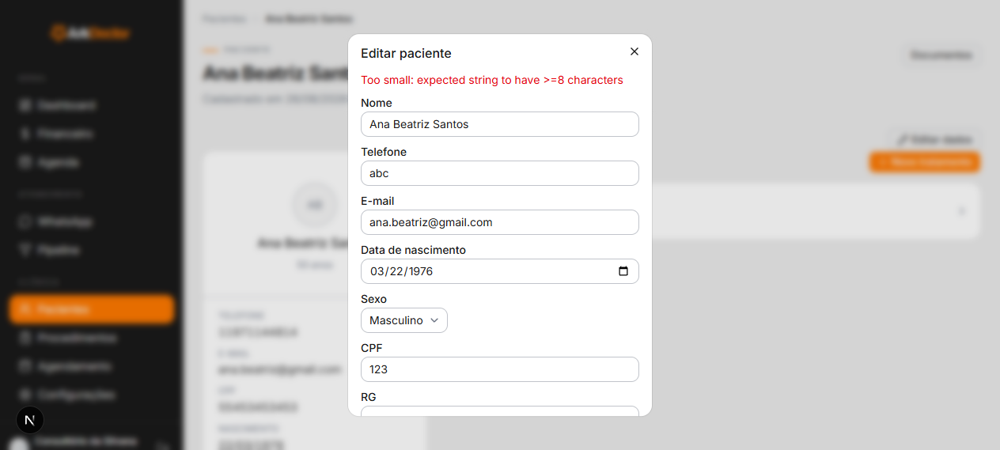

---

### ISSUE-002: CPF do paciente aceita valor inválido ("123") e persiste

| Field | Value |
|-------|-------|
| **Severity** | medium |
| **Category** | functional |
| **URL** | /pacientes/{id} → "Editar dados" |
| **Repro Video** | N/A |

**Description**

O campo CPF não tem nenhuma validação de formato/tamanho. Salvei `123` como CPF e o valor
foi persistido e aparece no detalhe do paciente ("CPF 123"). Num sistema clínico esse CPF
vai parar no PDF dos termos de consentimento. Esperado: validar 11 dígitos + dígitos
verificadores, ou ao menos exigir 11 dígitos.

**Repro Steps**

1. Abrir paciente → "Editar dados".
2. Campo CPF = `123`, telefone válido, "Salvar".
3. **Observe:** modal fecha sem erro; detalhe do paciente mostra "CPF 123".
   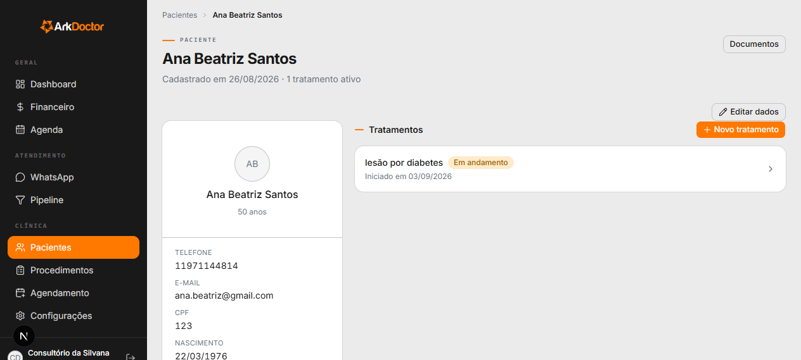

---

### ISSUE-003: "Sexo" do paciente vem como "Masculino" por padrão (paciente feminina marcada como Masculino)

| Field | Value |
|-------|-------|
| **Severity** | low |
| **Category** | functional / content |
| **URL** | /pacientes/{id} → "Editar dados" |
| **Repro Video** | N/A |

**Description**

No cadastro de "Ana Beatriz Santos" (nome feminino, nascida 1976) o campo Sexo está como
"Masculino". **Atualização:** o formulário "Novo paciente" mostra "Selecione" (vazio) corretamente, então
o form NÃO tem default ruim — o registro de seed da Ana provavelmente foi gravado com
sexo="masculino". É dado de seed; será resolvido ao zerar a base. Fica o lembrete de conferir
se o seed/importação não está gravando "masculino" quando o sexo é desconhecido.

**Repro Steps**

1. Abrir "Ana Beatriz Santos" → "Editar dados".
2. **Observe:** combobox "Sexo" = "Masculino".
   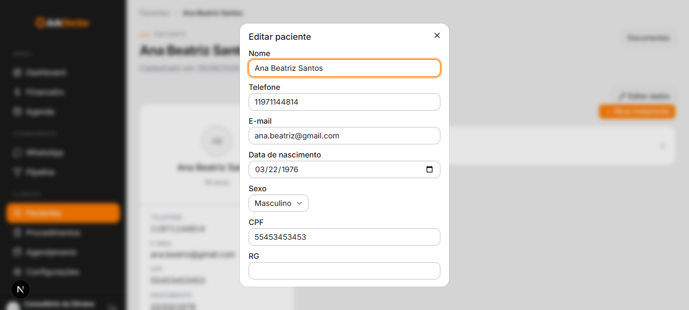

---

### ISSUE-005: "Idade" fica em branco no PDF do termo, mas aparece preenchida em toda pré-visualização

| Field | Value |
|-------|-------|
| **Severity** | medium |
| **Category** | functional / content |
| **URL** | /pacientes/{id}/documentos → "Ver PDF" |
| **Repro Video** | N/A |

**Description**

Na pré-visualização do termo (tanto em "Assinar de novo" quanto no link público /assinar)
o cabeçalho mostra "Idade: 50", calculada a partir da data de nascimento. No **PDF final
gerado e salvo** a mesma linha sai como `Idade: ____________________________` (em branco).
O documento assinado — que é o que tem valor — fica com a idade vazia. Ou preenche no PDF,
ou tira a linha.

**Repro Steps**

1. Abrir paciente com data de nascimento preenchida → Documentos → "Ver PDF" de um termo.
2. **Observe:** página 1, linha "Idade: ____" em branco, apesar de "Data de nascimento: 22/03/1976" logo acima.
   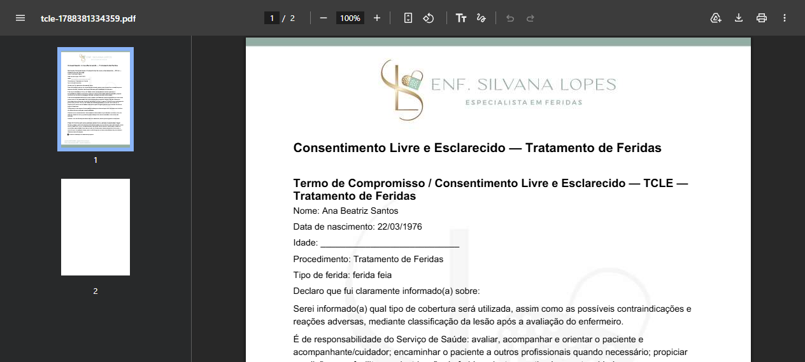
3. Comparar com a pré-visualização em "Assinar de novo": mostra "Idade: 50".
   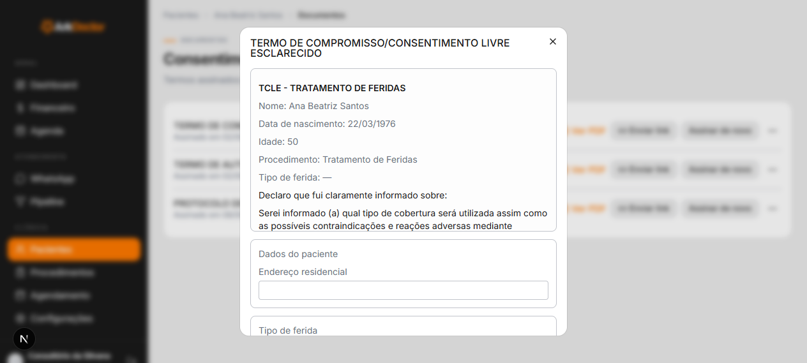

---

### ISSUE-006: Texto do termo na tela perde a pontuação e insere espaços ("informado (a)", vírgulas sumidas)

| Field | Value |
|-------|-------|
| **Severity** | low |
| **Category** | content |
| **URL** | /assinar/{token} e /pacientes/{id}/documentos → "Assinar de novo" |
| **Repro Video** | N/A |

**Description**

O corpo do termo exibido para o paciente antes de assinar aparece como:
"Serei informado (a) qual tipo de cobertura será utilizada assim como as possíveis
contraindicações e reações adversas mediante classificação..." — sem as vírgulas e com
espaço antes do "(a)". **No PDF o mesmo trecho está correto** ("...utilizada, assim como...
adversas, mediante...").

Ou seja: o texto-fonte (cópia literal do documento do advogado da Dra., que por regra do
projeto NÃO deve ser alterado) está certo; quem mexe no texto é o **componente que renderiza
a prévia na tela** (deve estar aplicando algum "normalize"/regex que come vírgulas e insere
espaço antes de parêntese). Fix é só no renderizador da prévia — não tocar em `templates.ts`.

**Repro Steps**

1. Abrir link público de assinatura de um termo (ou "Assinar de novo").
2. **Observe:** no bloco de texto do termo faltam vírgulas e há "informado (a)" com espaço.
   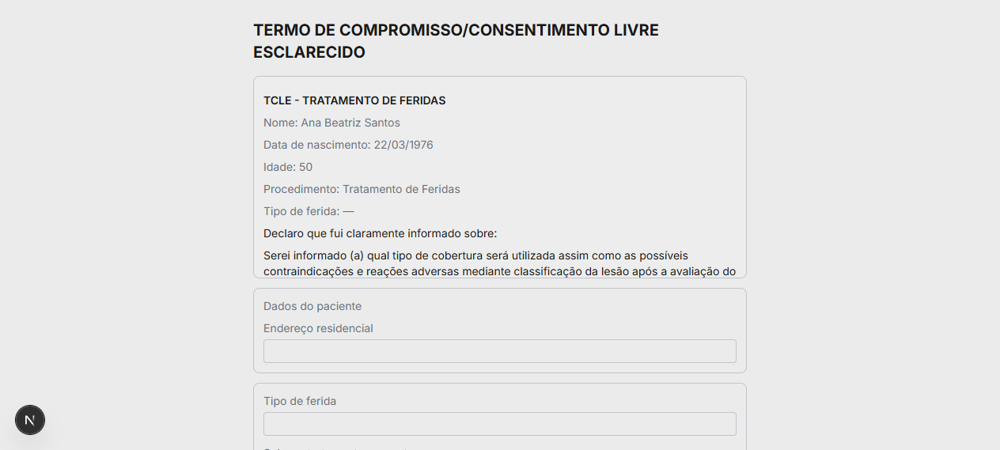

---

### ISSUE-007: Botão "Confirmar assinatura" fica habilitado sem assinatura no quadro (confirmado no código; NÃO é falha de dados)

| Field | Value |
|-------|-------|
| **Severity** | low |
| **Category** | ux |
| **URL** | /assinar/{token} e "Assinar de novo" |
| **Repro Video** | N/A |

**Description**

Confirmado lendo `consent-sign-form.tsx`: o `canSubmit` (que controla o `disabled` do botão)
checa nome + radio + dados do paciente, **mas não checa a assinatura**. Então o botão
"Confirmar assinatura" fica clicável assim que nome/radio estão ok, mesmo com o quadro vazio.

**Não é buraco de segurança:** `handleSubmit` (linha 131) tem a trava
`if (padRef.current?.isEmpty()) { setError("Assine no quadro antes de confirmar."); return; }`,
então clicar com o quadro vazio só mostra o erro — não registra nada.

É UX: o botão deveria ficar **desabilitado** até haver um traço, em vez de habilitado e
falhar no clique. Fix pequeno: `signature-pad.tsx` expõe `onEnd`, o form guarda `hasSignature`
no estado, entra no `canSubmit`, e o handler do "Limpar" zera esse estado.

---

### ISSUE-008: [DESCARTADO - não é bug] Nome/CNPJ da empresa no Termo de Imagem e Voz

Eu tinha marcado como crítico achando que "CICATRIZE MAIS FERIDAS / CNPJ 31.693.471/0001-56"
no corpo do termo era dado de template de outra empresa. **O usuário confirmou que essa É a
empresa da Silvana.** Não é bug.

Origem do meu erro: foi *inferência minha*, sem evidência. O timbre do PDF diz "ENF. SILVANA
LOPES", a conta chama "Consultório da Silvana" e o nome em Configurações que eu tinha acabado
de editar era "Silvana Lopes QA" — vi o nome de empresa diferente no meio do texto jurídico e
presumi que fosse sobra de template. Presunção errada. Fica só como observação: esse
nome/CNPJ está **fixo no template** (mesma classe da ISSUE-010) — só vira problema se um dia
a razão social mudar.

---

### ISSUE-009: Identidade da profissional é representada de 4 formas diferentes nos documentos; 2 termos ignoram a tela de Configurações

| Field | Value |
|-------|-------|
| **Severity** | high |
| **Category** | functional / content |
| **URL** | /configuracoes + /pacientes/{id}/documentos + relatório clínico |
| **Repro Video** | N/A |

**Description**

A tela de Configurações diz: _"Aparece no cabeçalho e no rodapé do relatório clínico e dos
termos de consentimento."_ Na prática:

| Documento | Como aparece a profissional |
|---|---|
| Relatório clínico | Usa a config: "Silvana Lopes QA — COREN-MT 481743" ✅ |
| Termo Laserterapia | **Fixo no template**: "Silvana Lopes \| Enfermeira \| Especialista em Feridas \| COREN-MT nº 481743" ❌ |
| Termo TCLE | Genérico: "Assinatura e carimbo do profissional de saúde" (sem nome) ❌ |
| Termo Imagem e Voz | Genérico: "Assinatura do responsável da empresa" + CNPJ fixo (ver ISSUE-008) ❌ |

Mudei o nome/registro em Configurações e só o relatório clínico refletiu. Se o COREN real
da Dra. não for exatamente "481743" / o nome não for "Silvana Lopes", os termos sairão com
credencial errada e a tela de Configurações não corrige.

**Repro Steps**

1. Configurações → trocar "Nome da profissional" e "Registro no conselho" → Salvar.
2. Gerar/abrir o PDF do relatório clínico → nome novo aparece.
3. Abrir "Ver PDF" do termo de Laserterapia → continua "Silvana Lopes ... COREN-MT nº 481743" fixo.

---

### ISSUE-010: Não existe configuração de marca/logo — timbre e rodapé dos PDFs são fixos ("ENF. SILVANA LOPES", telefone, Instagram e endereço embutidos)

| Field | Value |
|-------|-------|
| **Severity** | medium |
| **Category** | functional |
| **URL** | /configuracoes |
| **Repro Video** | N/A |

**Description**

A tela de Configurações só tem "Nome da profissional" e "Registro no conselho". O timbre
(logo "ENF. SILVANA LOPES / ESPECIALISTA EM FERIDAS") e o rodapé de todos os PDFs
("(66)-996720888  @enfsilvanalopes  Av. das Acácias, 697 - Jardim Botânico") estão fixos
em arquivo/template. Se qualquer um desses dados mudar (telefone, endereço, @, arte do
logo), não há como ajustar pela interface. Ok se a decisão é single-tenant e esses dados
já são os corretos da Dra. — mas então convém confirmar que telefone/endereço/@ do rodapé
estão certos, porque hoje ninguém consegue editá-los no app.

**Repro Steps**

1. Abrir /configuracoes → não há campo de logo, telefone, endereço ou redes.
2. Abrir qualquer "Ver PDF" de termo → timbre e rodapé fixos.

---

### ISSUE-011: Termo de Imagem e Voz — assinatura da paciente adulta rotulada como "Assinatura do responsável"; página 2 quase inteira em branco

| Field | Value |
|-------|-------|
| **Severity** | low |
| **Category** | content / visual |
| **URL** | /pacientes/{id}/documentos → Termo de Imagem e Voz → Ver PDF |
| **Repro Video** | N/A |

**Description**

A paciente (adulta, assinando por si) aparece sob o rótulo "Assinatura do responsável" —
deveria ser "titular" / "de quem consente" quando não é representante legal. Além disso a
página 2 do PDF tem só a linha "Assinatura do responsável da empresa" no topo e o resto da
folha em branco (com marca d'água), desperdiçando uma página inteira.

**Repro Steps**

1. Abrir "Ver PDF" do Termo de Imagem e Voz.
2. **Observe:** rótulo "Assinatura do responsável" sob a assinatura da paciente; página 2 vazia.

---

### ISSUE-012: Agendamento oferece horários no fim do dia sem checar se procedimento+duração cabe no expediente (canal de 90 min às 17:30 → termina 19:00)

| Field | Value |
|-------|-------|
| **Severity** | medium |
| **Category** | functional |
| **URL** | /agendamento (e link público de agendamento) |
| **Repro Video** | N/A |

**Description**

Os horários oferecidos vão de 08:00 a 17:30 (janela aparente 08:00–18:00). Para um
procedimento de 90 min ("Tratamento de Canal"), o sistema ainda oferece **17:00 e 17:30**
como início. Marquei 17:30 → agendamento criado das **17:30 às 19:00**, 1 h além da janela.
O último início oferecido deveria ser 16:30 para um procedimento de 90 min. A checagem de
conflito com outros agendamentos funciona bem (o slot da Ana às 14:00 fica bloqueado, e
para o procedimento de 90 min bloqueia 13:00/13:30/14:00 corretamente) — o que falta é a
checagem contra o fim do expediente.

**Repro Steps**

1. /agendamento → "Tratamento de Canal (90min)" → Próximo.
2. Escolher QUI 10 → horários disponíveis incluem 17:00 e 17:30.
   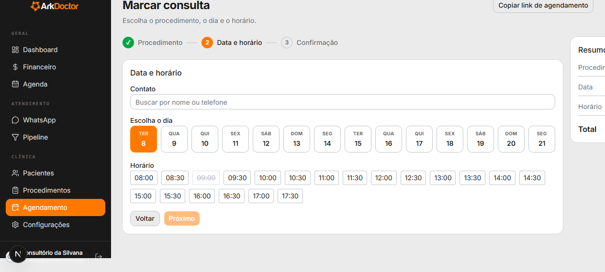
3. Escolher 17:30 → contato → Confirmar.
4. **Observe:** na Agenda, o bloco de Bruno vai de 17:30 até 19:00.
   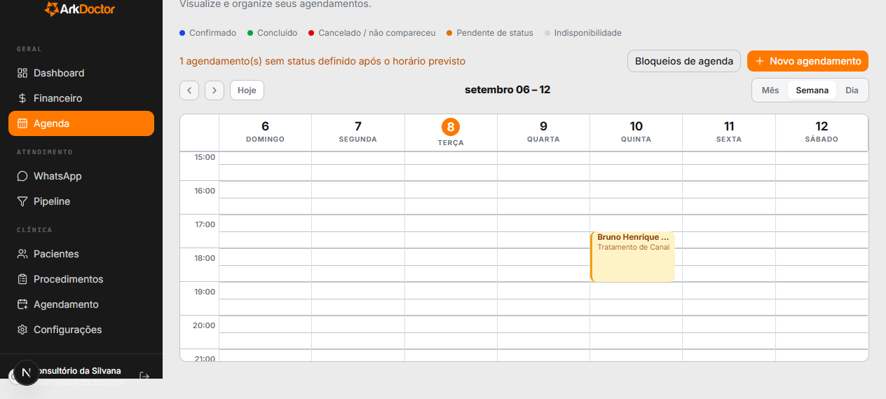

---

### ISSUE-013: "Adicionar" bloqueio de agenda com dados inválidos estoura erro de servidor não tratado (parseOrThrow)

| Field | Value |
|-------|-------|
| **Severity** | high |
| **Category** | functional / console |
| **URL** | /agenda → "Bloqueios de agenda" → Recorrentes → Adicionar |
| **Repro Video** | N/A |

**Description**

Ao clicar "Adicionar" num bloqueio recorrente com **Início depois do Fim (12:00 → 11:00) e
Motivo vazio**, a server action lançou um erro **não tratado**, mostrado como Runtime Error
(Server) do Next.js:

```
src\lib\zod-error.ts (10:11) @ parseOrThrow
  throw new Error(friendlyMessage(result.error));
src\modules\scheduling\service.ts (321:29)
src\app\(app)\agenda\actions.ts (136:55)
```

Ou seja: o Zod falha e o código **joga** o erro em vez de devolver a mensagem pro formulário.
Em dev aparece a tela vermelha; em produção a server action só rejeita e o usuário fica sem
feedback e sem o bloqueio. Com dados válidos (09:00→10:00 + motivo) funciona normal. Precisa
validar no cliente (Fim > Início, Motivo obrigatório se for) e/ou a action retornar erro
tratado em vez de `throw`.

**Repro Steps**

1. /agenda → "Bloqueios de agenda".
2. Em "Recorrentes (semanais)", deixar Início 12:00 / Fim 11:00, Motivo em branco.
3. Clicar "Adicionar".
4. **Observe:** overlay "Runtime Error / Server" apontando `zod-error.ts` `parseOrThrow`.
   

---

### ISSUE-014: Gráficos (Recharts) logam "width(0) and height(0)" e saem sem eixos/valores no Dashboard e Financeiro

| Field | Value |
|-------|-------|
| **Severity** | low |
| **Category** | console / visual |
| **URL** | /dashboard, /financeiro |
| **Repro Video** | N/A |

**Description**

O console repete 4x: _"The width(0) and height(0) of chart should be greater than 0..."_
(Recharts `ResponsiveContainer` sem altura). Os gráficos "Receita — últimos 6 meses" e
"Receita vs. despesas" renderizam a área/barras mas **sem rótulos de eixo nem valores**, o
que dificulta a leitura. Provável container sem `min-height` quando fora da viewport / em
aba recolhida.

**Repro Steps**

1. Abrir /dashboard (ou /financeiro), abrir o console.
2. **Observe:** avisos de width/height 0; gráfico sem eixo Y nem números.
   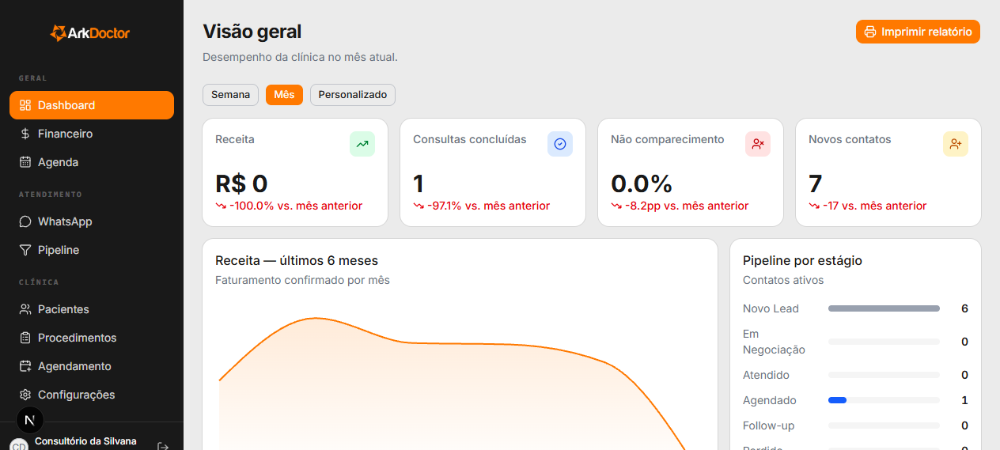

---

### ISSUE-015: Blocos de agenda e datas exibem segundos / formato técnico ("09:00:00–10:00:00")

| Field | Value |
|-------|-------|
| **Severity** | low |
| **Category** | content / visual |
| **URL** | /agenda → "Bloqueios de agenda" |
| **Repro Video** | N/A |

**Description**

Bloqueio recorrente adicionado aparece como "Segunda, **09:00:00–10:00:00** (Motivo)". Os
segundos são ruído; o padrão do resto do app é HH:MM.

**Repro Steps**

1. /agenda → "Bloqueios de agenda" → adicionar um bloqueio recorrente válido.
2. **Observe:** a linha listada mostra `09:00:00–10:00:00`.
   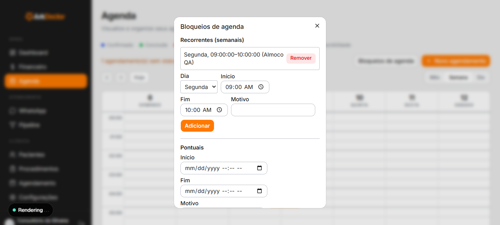

---

### ISSUE-016: Dados de seed inconsistentes com o tipo de clínica (procedimentos de dentista numa clínica de feridas)

| Field | Value |
|-------|-------|
| **Severity** | low (seed) |
| **Category** | content |
| **URL** | /procedimentos, /agendamento, /financeiro |
| **Repro Video** | N/A |

**Description**

A clínica é de cuidado de feridas (timbre "ENF. SILVANA LOPES — Especialista em Feridas",
termos de laserterapia/TCLE de feridas), mas os procedimentos cadastrados são todos de
odontologia: "Aplicação de Flúor", "Clareamento Dental", "Extração de Siso", "Tratamento de
Canal", "Manutenção Ortodôntica"... O texto de apoio também fala "Marcar consulta / Escolha
o procedimento". Como você vai zerar os dados antes de entregar, é só um lembrete de cadastrar
os procedimentos reais e revisar textos que assumem "consulta/dentista".

**Repro Steps**

1. Abrir /procedimentos.
2. **Observe:** lista 100% odontológica.
   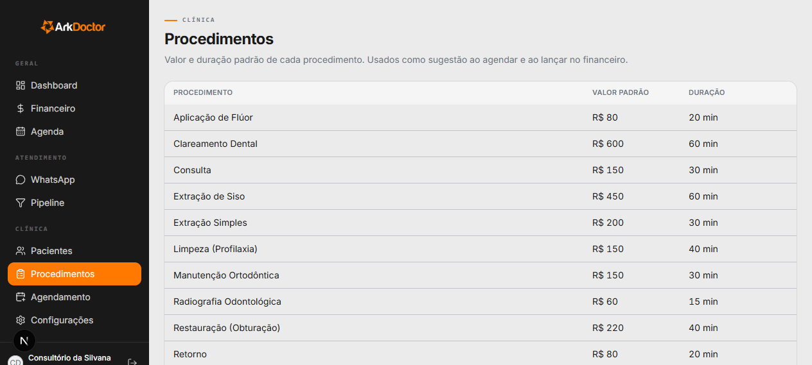

---

### ISSUE-017: [NÃO CONFIRMADO] Sessão caiu para /login 2x durante ~15 min de teste

| Field | Value |
|-------|-------|
| **Severity** | medium (se confirmado) |
| **Category** | functional |
| **URL** | app inteiro |
| **Repro Video** | N/A |

**Description**

Durante o teste, ao navegar para uma rota profunda (ex.: /pacientes/{id}/documentos), o app
redirecionou para /login duas vezes, exigindo novo login, num intervalo de ~15 min — bem
antes do TTL normal de 1h do Supabase. Pode ser efeito da minha automação (2 sessões de
navegador simultâneas, uma não autenticada em /assinar), então **não é conclusivo**.
Verificar manualmente: usar o app normalmente por 20–30 min e ver se desloga sozinho.

---

### ISSUE-004: Inputs nativos de data/e-mail seguem o locale do navegador, não o do app (data MM/DD/YYYY, popup de e-mail em inglês)

| Field | Value |
|-------|-------|
| **Severity** | low |
| **Category** | content / ux |
| **URL** | /pacientes/{id} → "Editar dados"; /agenda → "Novo agendamento" |
| **Repro Video** | N/A |

**Description**

Os campos de data usam `<input type="date/datetime-local">` nativos. Com o navegador em
inglês, "Data de nascimento" aparece como `03/22/1976` (MM/DD/YYYY) e a validação de e-mail
mostra "Please include an '@' in the email address." em inglês, dentro de um app pt-BR.
Na máquina da Dra. (navegador pt-BR) o formato muda, mas a app fica dependente do locale do
SO. Vale checar se um date picker próprio não seria mais previsível.

**Repro Steps**

1. Abrir paciente → "Editar dados" (navegador em inglês).
2. **Observe:** data no formato americano; e-mail inválido dispara popup nativo em inglês.
   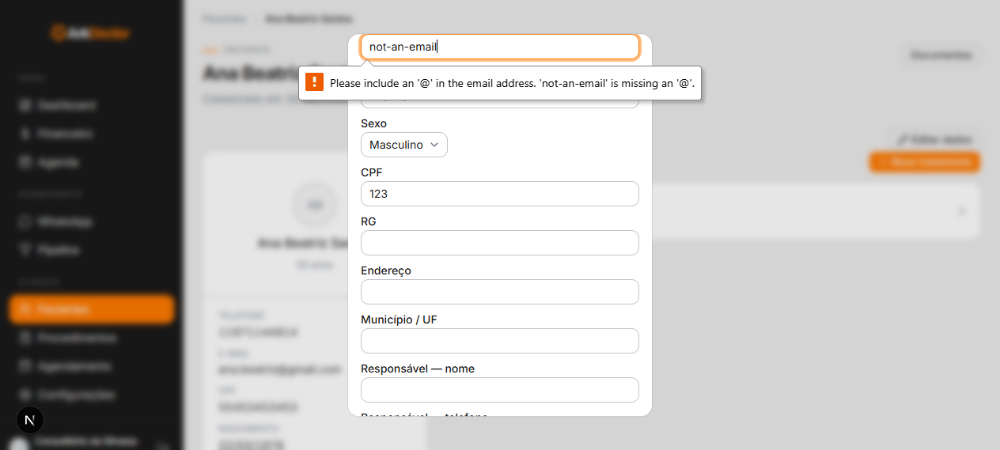

---

